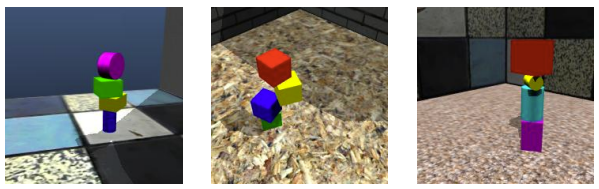
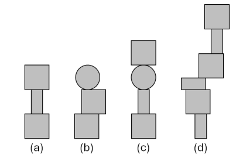

# CV-project

## Description

A key application in computer vision is understanding physical relations between objects in the world. For example, self-driving cars must be able to use visual and other sensor data to reason about the location, speed, and trajectory of nearby objects in order to move safely on public streets. A robot working in a home or factory setting may need to use vision to solve everyday physics problems, such as how to pack items into boxes, how to place items onto shelves, or how to pick up and deposit items without breaking them.

In this project, you will develop an algorithm to solve a common visual physical reasoning task, which is predicting the stability of a stack of blocks from a single image. This task is challenging because the stacks of blocks have varying appearances, and they may appear against different backgrounds with different lighting and camera conditions. There are many possible ways to approach the task: for example, you might try to identify the individual blocks in the stack and their relative locations, or evaluate the 3d shape of the stack, or try to identify holistic features that distinguish between “stable” and “unstable” stacks.

Whatever methods you choose, you are expected to evaluate these methods using the provided data, to critically analyse the results, and to justify your design choices in your final report. Your evaluation should include error analysis, where you attempt to understand where your method works well and where it fails.

You are encouraged to use existing computer vision libraries your implementation. You may also use existing models or pretrained features as part of your implementation. However, your method should be your own; you may not simply submit an existing model for this problem.

 
 
    
 

Figure 1: Examples of images from the ShapeStacks dataset [1]. The leftmost image shows a stable block stack, while the middle and rightmost images show unstable stacks.

## Dataset
The dataset provided is a subset of the ShapeStacks dataset [1]. The images are synthetic scenes produced by a 3D rendering software. Each scene shows a vertical stack of blocks; the blocks have various colours and shapes (cubes, rectangular solids, spheres, cylinders) and the height of the stack varies from 2-6 blocks. Figure 2 shows examples of images from the dataset.

Your task is to build a model which can predict the stable height of the block stack, which is the number of blocks which have been placed appropriately such that they will not fall down. In a “stable” stack the stable height is identical to the total number of blocks. In an “unstable” stack the stable height is the height of the balanced portion of the stack; blocks above the stable height have been placed incorrectly and will fall down. Figure 3 shows diagrams of stacks which have a stable height of 3, which means that in each case the first 3 blocks have been placed correctly and are stable, but blocks above level 3 have been placed incorrectly and would fall down.

 
 
    
 

Figure 2: Diagrams of block stacks which have a stable height of 3. (a) and (b) are stable. In (c), the fourth block will fall down because a spherical block cannot support other blocks. In (d), the fourth and higher blocks would fall down because their centre of mass is not supported by the blocks below.

To build a stable stack, each block must be placed on a flat surface and the centre of mass of the block must be supported by the surface below. In unstable stacks, there is exactly one block placement that violates these rules. In all scenes, the bottom block of the stack is guaranteed to be stably placed, so the stable height of the stack cannot be less than 1.

You may use the provided training images however you wish to train your model. We have also provided some metadata for the training images, which you can use to help train or evaluate methods. You are allowed to use pretrained features, data augmentation, or supplemental images or data as part of your method. **However, your solution must not use any of following:**

*  Additional images, supplemental data, or metadata from the ShapeStacks dataset which were not provided with this assignment
  
*  Any models which were pretrained on the publicly-released ShapeStacks dataset
  
This assignment uses a custom train/test split of the dataset, so if you use the full public dataset or pretrained models, your method will be trained, in part, on the Kaggle test set. Any submitted method which involves training on the test set (or simply looking up the ground truth labels for the Kaggle test set) will be considered cheating and will  receive 0 marks.

## Code Using Guide

* Please place the train.csv, test.csv, test folder, train folder in the same dir as this juypter notebook.

* Project purpose: Design a method to predict the stability of a stack of blocks from a single image.

### Data Preprocessing：

Execute the first 8 code cells of the jupyter notebook in order

This includes importing training and test data, data preprocessing in the first stage, and data splitting and preprocessing in the second stage.

### Baseline comparison (phase 1)：

1.	Execute vitmodel, inceptionv4model, resnetmodel and mobilemodel.
2.	Execute loss function weight allocation
3.	Execute function stable_height_validate(model, eval_loader), used to evaluate the performance of the model on the validation set
4.	Perform different model training in sequence
5.	Execute function modeltraining(model,savepath,log) for each model in turn. Note that savepath is the weight of the saved model, and log is the data result of the training model (on tensorboard)
6.	Execute function modelpredict(model, save_path) for each model in turn:
7.	Input  %load_ext tensorboard and %tensorboard --logdir=runs to open tensorboard to view the training and validation results of all models.

### Improved model(phase 2)
1.	Execute model1 as instability_type_model
2.	Training model1
3.	Execute model2 and use model2 to define type_0_model, type_1_model, type_2_mode
4.	Train three models separately
5.	Execute function predict(model, save_path) to predict the instability type for each test image
6.	Execute function predict(model, save_path, loader) to predict the stable height for each type
7.	Combine the prediction results of each type and sort them according to the order of the ids in test dataset

All experiments can be completed by executing jupyter notebook in sequence

## References
[1] O. Groth, F. B. Fuchs, I. Posner, and A. Vedaldi, “Shapestacks: Learning vision-based physical intuition for generalised object stacking,” in Computer Vision – ECCV 2018, V. Ferrari, M. Hebert, C. Sminchisescu, and Y. Weiss, Eds. Cham: Springer International Publishing, 2018, pp. 724–739.
